## 📌 The Situation

Maven Fuzzy Factory has been live for ~8 months, and your CEO is due to present company performance metrics to the board next week. You’ll be the one tasked with preparing relevant metrics to show the company’s promising growth.

## 📌 The Objective

Use SQL to :
Extract and analyze website traffic and performance data from the Maven Fuzzy Factory database to quantify the company’s growth, and to tell the story of how you have been able to generate that growth.

## 📌 Questions

💡**1 - Gsearch seems to be the biggest driver of our business. Could you pull monthly trends for gsearch sessions and orders so that we can showcase the growth there?**

#### Steps:

- Extract month from date, calculate relavant sessions and orders where source is gsearch
- Aggregate to find conversion rate for every month 

#### Query:

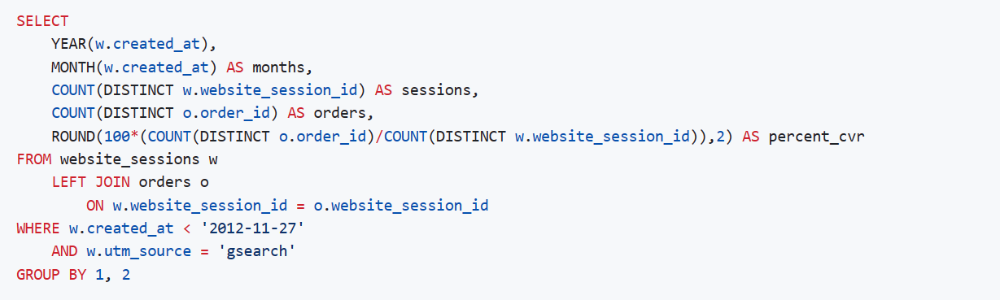

#### Result:

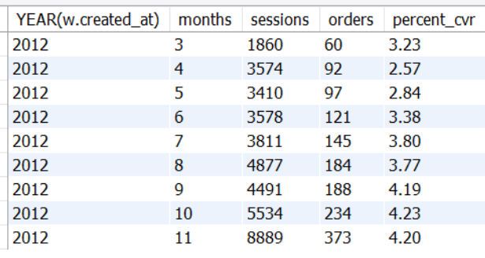

- Session to order growth remained stable and saw a steady increase from March (3.23%) to November (4.20%).

💡**2 - Next, it would be great to see a similar monthly trend for Gsearch, but this time splitting out nonbrand and brand campaigns separately. I am wondering if brand is picking up at all. If so, this is a good story to tell.**

#### Steps:

- Extract month from date, calculate relavant sessions and orders based on source is gsearch
- Aggregate to find conversion rate for every month based on campaign

#### Query:

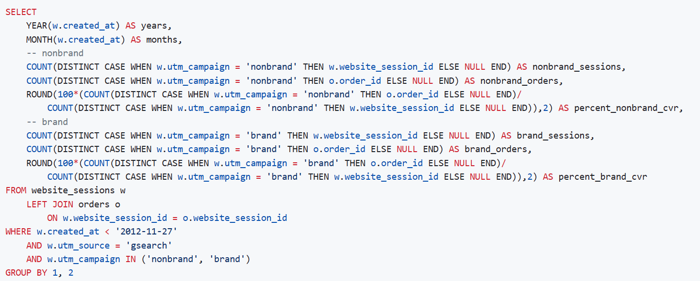

#### Result:

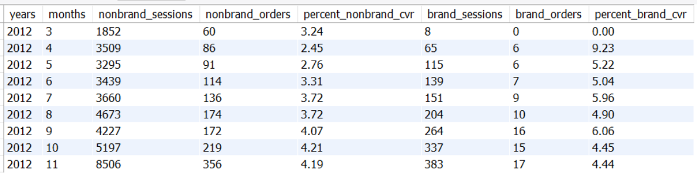

- We can see that the percentage of conversion rate of nonbrand campaign steadily grows from 3% to 4%. But, the brand campaign has fluctuating conversion rates/trends every month.

💡**3 - While we’re on Gsearch, could you dive into nonbrand, and pull monthly sessions and orders split by device type? I want to flex our analytical muscles a little and show the board we really know our traffic sources.**

#### Steps:

- Extract month from date, calculate relavant sessions and orders based on source is gsearch
- Aggregate to find nonbrand conversion rate for every month based on device type

#### Query:

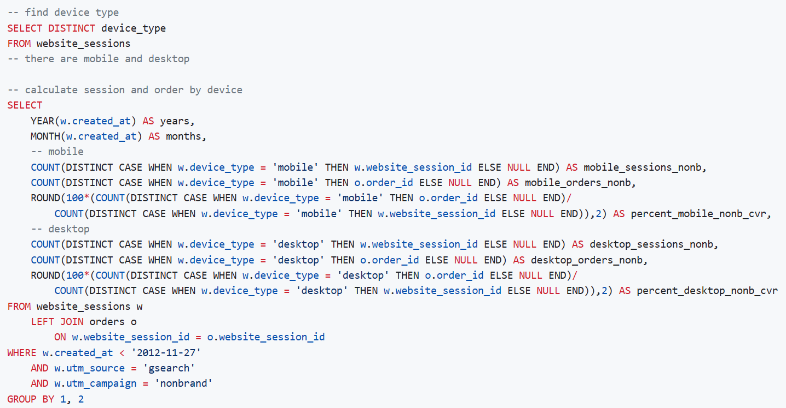

#### Result:

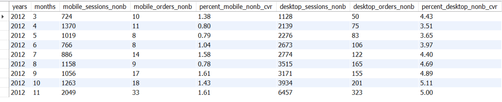

- The majority of the conversion rate contribution came from desktop users with a good growth from 4.43% in March, it dropped in April to 3.51%, but continued to increase in the following months to reach 5% in November. The contribution with mobile devices is quite low and there is a need to investigate this, it could be that the web accessed through mobile is not user friendly.

💡**4 - I’m worried that one of our more pessimistic board members may be concerned about the large % of traffic from Gsearch. Can you pull monthly trends for Gsearch, alongside monthly trends for each of our other channels?**

#### Steps:

- Find the various utm sources and refers to see the traffic we're getting
- Extract months and aggregate to find each session based on the last output condition

#### Query:

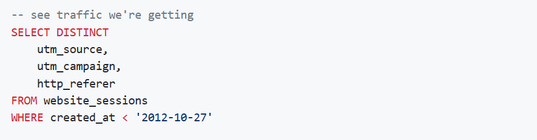

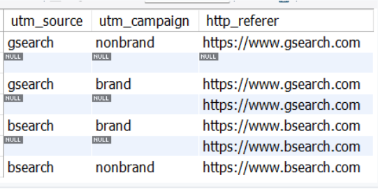

From the output we can see:

- Source of traffic from gsearch and bsearch
- Based on the output :
   - If source, campaign, and http referral is NULL, then it is direct traffic: users type in the website link in the browser's search bar
   - If source and campaign is NULL, but there is http referral, then it is organic search: coming from search engine and not tagged with paid parameters

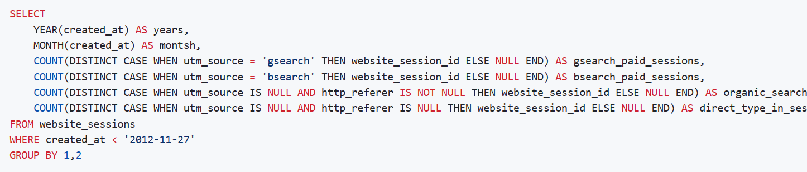

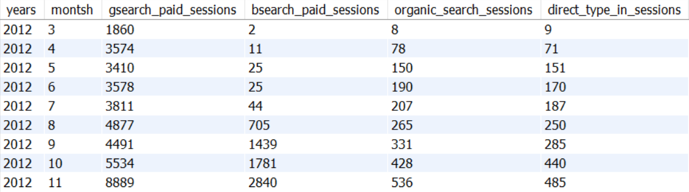

- Gsearch is the dominant traffic among other channels. Not only gsearch, each channel also experiences session growth every month.

💡**5 - I’d like to tell the story of our website performance improvements over the course of the first 8 months. Could you pull session to order conversion rates, by month?**

#### Steps:

- Extract month from date, calculate relavant sessions and orders
- Aggregate to find conversion rate for every month sessions

#### Query:

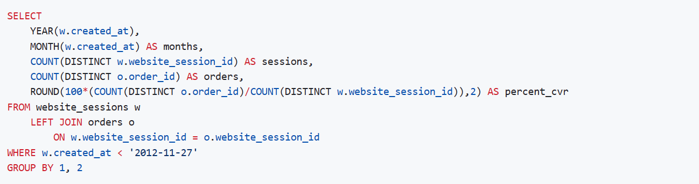

#### Result:

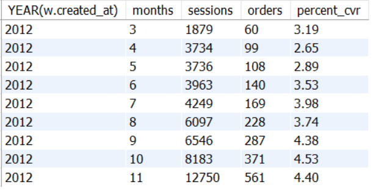

- The conversion rate in March was 3.19% and decreased in the next month. The conversion rate started to increase steadily in the following month until it reached 4.40% in November.

💡**6 - For the gsearch lander test, please estimate the revenue that test earned us (Hint: Look at the increase in CVR from the test (Jun 19 – Jul 28), and use nonbrand sessions and revenue since then to calculate incremental value)**

#### Steps:

- Find lander-1 test was created and the first website_pageview_id, retricting to home and lander-1
- Create summary, join the result with order_id and aggregat for session, order, and cvr
- Find most recent pageview for gsearch nonbrand where traffic was sent to /home and estimate revenue that test earned from lander-1

#### Query:

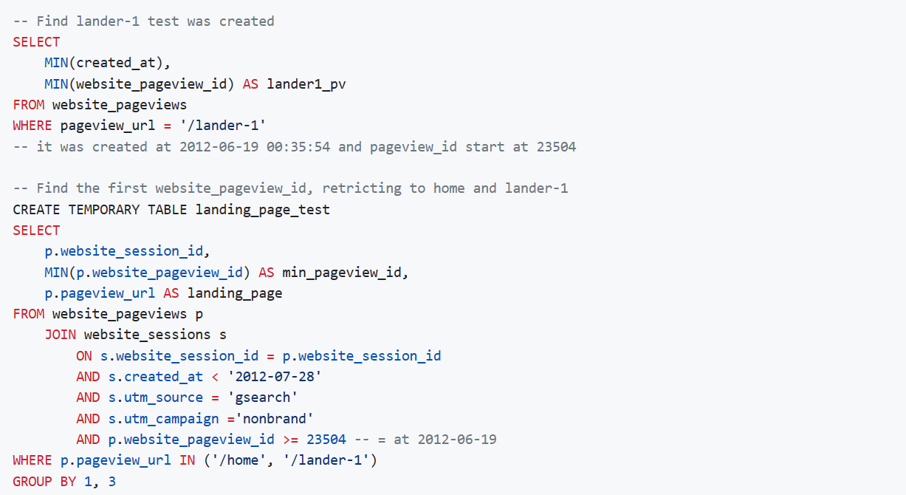

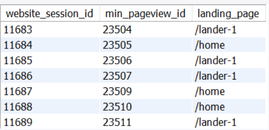

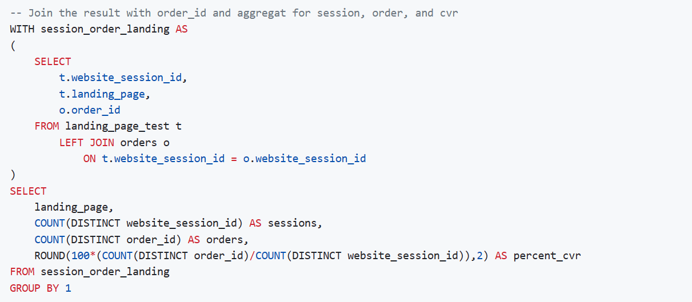

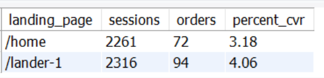

- The home page conversion rate is 3.18% and lander-1 is 4.06%. The incremental difference in website performance is 1.08% using lander-1.

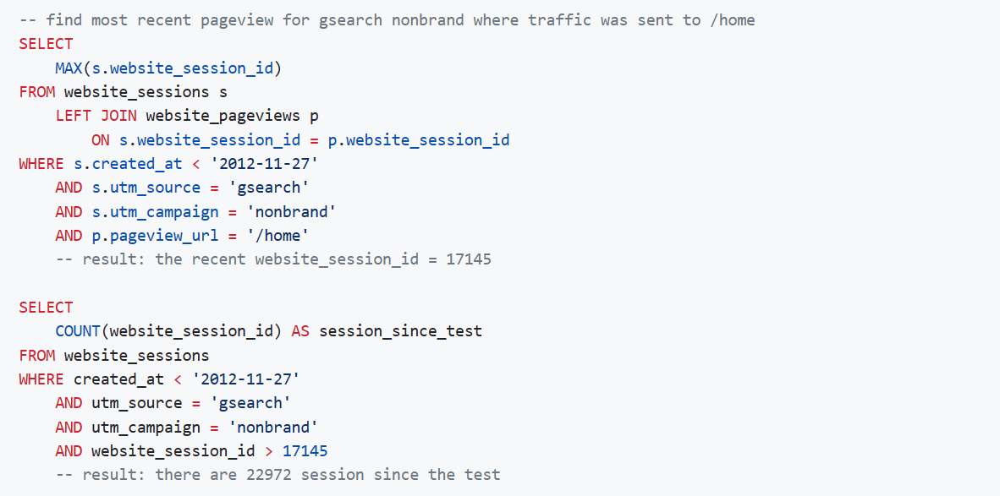

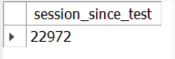

- We can estimate the increase in revenue from the increase in orders:
    - 22972 session x 1.08% (incremental % of order) = 248
    - So, estimated at least 248 incremental orders since 29 Jul using the lander-1 page
- Calculate monthly increase (July - November):
    - 248 / 4 = 64 additional order/month

💡**7 - I’d like to tell the story of our website performance improvements over the course of the first 8 months. Could you pull session to order conversion rates, by month?**

#### Steps:

- Check pageview_url from two pages was created and create summary all pageviews for relevant session
- Categorise website sessions under segment by 'saw_home_page' or 'saw_lander_page' and aggregate data to assess funnel performance
- Convert aggregated result to percentage of click rate

#### Query:

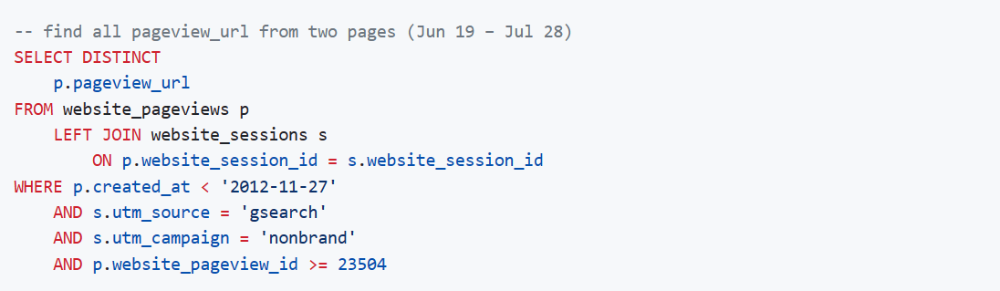

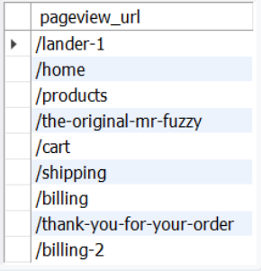

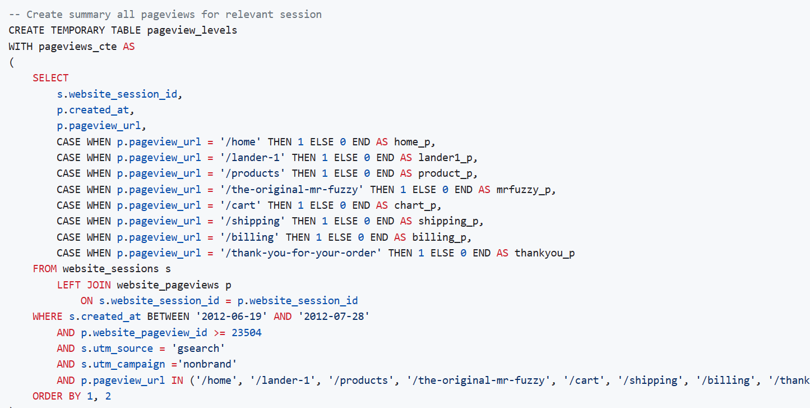
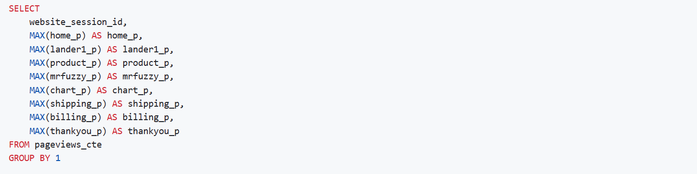 

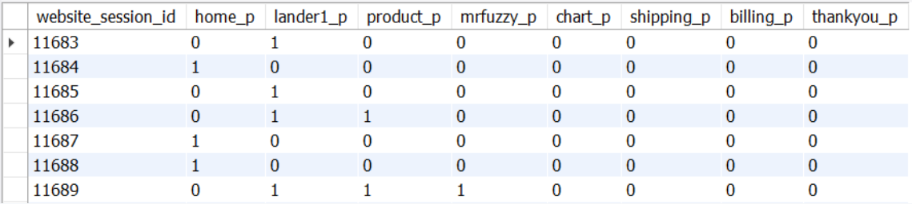

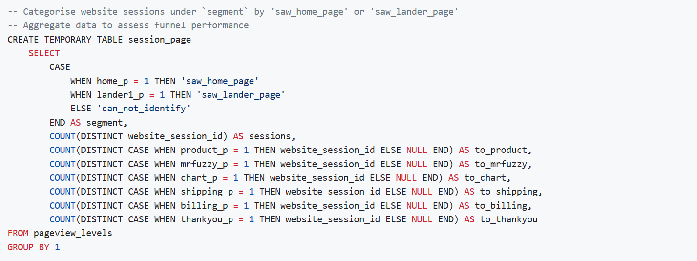

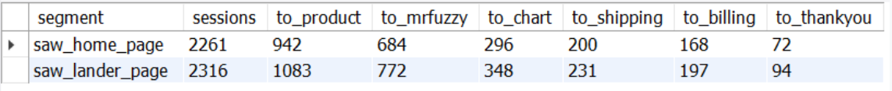

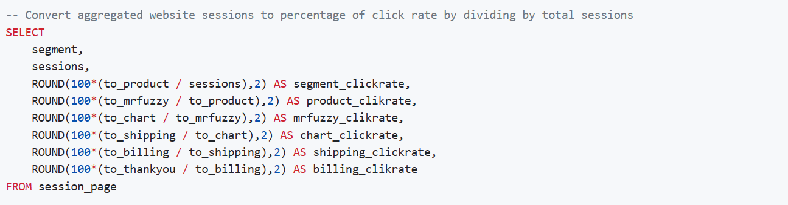

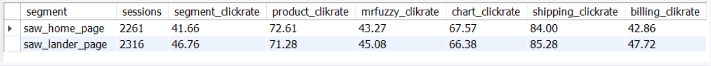

- Lander-1 page has a better click trough rate than the home page.

💡**8 - I’d love for you to quantify the impact of our billing test, as well. Please analyze the lift generated from the test (Sep 10 – Nov 10), in terms of revenue per billing page session, and then pull the number of billing page sessions for the past month to understand monthly impact.**

#### Steps:

- Check billing-2 test was created
- Calculate or aggregate the sessions and price_usd for /billing and /billing-2
- Calculate billing page sessions for the past month (Sep 27 – Nov 27) and estimate revenue

#### Query:

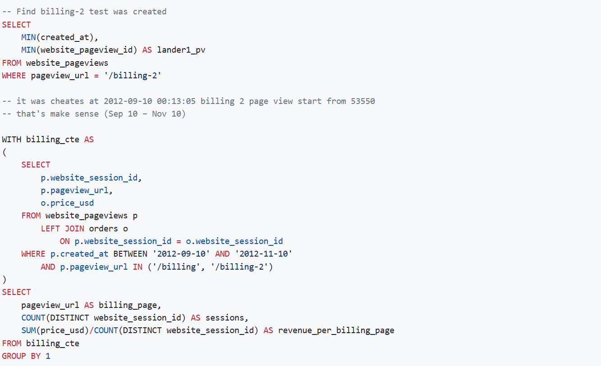

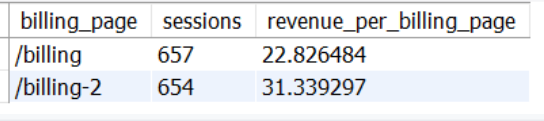

- billing-2 has a larger revenue per billing page contribution with a lift of 8.51 dollars/pageview

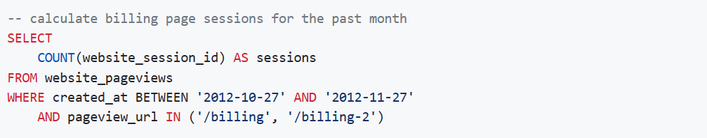

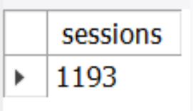

- We can calculate from the past month:
    - Total session a month = 1193
    - Value billing test = 1193 X 8.51 (lift) = 10152.43
- So there are 1193 sessions and with the increase of 8.51 dolar average revenue per session with a positive impact 10152.43 dolar increase in revenue

